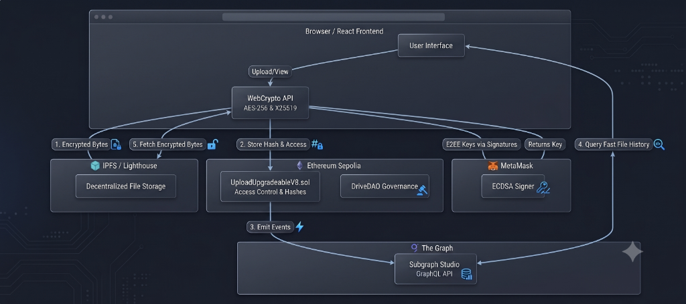

# 🔐 Blockchain Drive (Decentralized Secure File Storage)

Blockchain Drive is a robust, highly secure, and fully decentralized file storage platform built on Ethereum and IPFS. It goes far beyond standard decentralized storage by offering **Military-Grade End-to-End Encryption (E2EE)**, **Zero-Knowledge Proof (ZKP) Verification**, **Steganography**, and a decentralized indexing layer via **The Graph**.

Whether you want to securely store personal files, share data with other Ethereum addresses via access control, or participate in the protocol's governance via the **Drive DAO**, this platform provides a complete Web3 ecosystem.

---

## ✨ Key Features

- **End-to-End Encryption (E2EE):** All files are encrypted locally in the browser using AES-256 before ever touching the network. Keys are deterministically derived from your MetaMask signature, meaning only you (and users you authorize) can decrypt your data.
- **Decentralized Storage (IPFS):** Encrypted files are pinned securely to the InterPlanetary File System (IPFS) via Lighthouse Storage.
- **The Graph Protocol:** Frontend data (like your Dashboard and file history) is indexed and queried blazingly fast using a custom Subgraph hosted on Subgraph Studio.
- **Advanced Steganography:** Hide the very existence of your data. The platform can mathematically inject your encrypted files inside locally-generated organic noise images (Data Matrices) before upload.
- **Zero-Knowledge Proofs (ZKP):** Verify file integrity and validate uploads mathematically without revealing the underlying data.
- **Drive DAO Governance:** Earn `DRIVE` tokens and use them to vote on protocol upgrades. The platform features a fully upgradeable smart contract architecture controlled by the community.
- **Access Control & Versioning:** Share files with other addresses (permanently or time-locked) and manage version histories with complete blockchain transparency.

---

## 🛠️ Technology Stack

- **Frontend:** React.js, Vite, Tailwind CSS, Apollo Client (GraphQL), Ethers.js
- **Smart Contracts:** Solidity, Hardhat, OpenZeppelin (Upgradeable & DAO Contracts)
- **Cryptography:** CryptoJS (AES-256), SnarkJS (Zero-Knowledge Proofs)
- **Indexing:** The Graph (Subgraph Studio), GraphQL
- **Storage:** IPFS (Lighthouse)
- **Network:** Ethereum Sepolia Testnet (or Local Hardhat Node)

---

## 📋 Prerequisites

To run this project locally, you will need the following installed on your machine:
1. **Node.js** (v18 or higher recommended)
2. **MetaMask** wallet extension installed in your browser.
3. **Lighthouse Account:** Get a free API Key from [Lighthouse Storage](https://www.lighthouse.storage/).
4. **Alchemy / Infura:** Get a free Sepolia RPC URL (e.g., from [Alchemy](https://www.alchemy.com/)).
5. **Subgraph Studio:** Create a free account at [The Graph Studio](https://thegraph.com/studio/) and create a subgraph named `blockchain-drive`.
6. **Sepolia Testnet ETH:** You will need test ETH to deploy contracts.

---

## 🚀 Installation & Setup Guide

### 1. Clone the Repository
```bash
git clone https://github.com/yourusername/Blockchain-Drive.git
cd Blockchain-Drive
```

### 2. Smart Contract Setup & Deployment
First, compile and deploy the core logic to the blockchain.

```bash
cd smart_contract
npm install
```

**Create Environment Variables:**
Create a `.env` file in the `smart_contract` directory:
```env
SEPOLIA_URL=https://eth-sepolia.g.alchemy.com/v2/YOUR_ALCHEMY_KEY
PRIVATE_KEY=your_metamask_private_key
```

**Deploy to Sepolia:**
Run the deployment script to deploy the main upgradeable contract.
```bash
npx hardhat run scripts/deploy-v8-direct.js --network sepolia
```
*Note: Save the deployed Contract Address outputted in the terminal. You will need it for the Subgraph and Frontend.*

### 3. The Graph (Subgraph) Setup
To make frontend queries fast, we need to deploy the indexer to Subgraph Studio.

```bash
cd ../subgraph
npm install -g @graphprotocol/graph-cli
npm install
```

**Configure Subgraph:**
Open `subgraph.yaml` and update the `address` field under `source` with the Smart Contract address you just deployed.

**Authenticate and Deploy:**
Go to your Subgraph Studio dashboard to get your `DEPLOY KEY`.
```bash
graph auth --studio YOUR_DEPLOY_KEY
npm run build
graph deploy --studio blockchain-drive
```
*Note: Save the `Queries (HTTP)` URL outputted after a successful deployment.*

### 4. Frontend Setup
Finally, start up the React application.

```bash
cd ../client
npm install
```

**Create Environment Variables:**
Create a `.env` file in the `client` directory:
```env
VITE_LIGHTHOUSE_API_KEY=your_lighthouse_api_key
```

**Update Configurations:**
1. Open `client/src/utils/constants.js` and paste your deployed **Smart Contract Address**.
2. Open `client/src/main.jsx` and replace the Apollo Client `uri` with your **Subgraph Query URL**.

**Run the Application:**
```bash
npm run dev
```
The application will launch on `http://localhost:5050` (or `5173`).

---

## 💻 How to Use the Platform

1. **Connect Wallet:** Open the app and connect your MetaMask (ensure you are on the Sepolia network).
2. **E2EE Setup (Passwordless):** The first time you upload a file, the platform will prompt you to cryptographically sign a message using MetaMask. This 256-bit signature deterministically generates your private encryption keys locally in the browser, providing uncrackable security without needing to remember a Master Password.
3. **Upload Files:** Go to the "Files" tab to upload data. The file is AES-256 encrypted in memory, pushed to IPFS, and the hash is saved to the blockchain.
4. **Use Steganography:** Toggle "Use Steganography" during upload to mathematically hide your encrypted payload inside an auto-generated noise image for absolute privacy.
5. **Share Data:** Go to the "Share" tab to grant access to other Ethereum wallets.
6. **Governance:** Go to the "DAO" tab, claim your free `DRIVE` tokens from the Faucet, and vote on community protocol upgrades!

---

## 🛡️ Architecture Diagram



---

## 🚨 Threat Model

When evaluating the security of Blockchain Drive, it is important to understand exactly what the system protects against, and its known boundaries.

### What it Protects Against (In-Scope)
- **Compromised Storage Providers:** Even if Lighthouse or the underlying IPFS node operators inspect your files, they will only see AES-256 encrypted gibberish. The server cannot read your data.
- **Offline Dictionary Attacks:** By deriving E2EE keys from Ethereum wallet signatures (`personal_sign`) rather than human-generated passwords, the encryption keys possess 256 bits of pure entropy, rendering offline brute-forcing physically impossible.
- **Access Control Griefing:** Smart contract functions strictly enforce `_ownsFile(msg.sender)`, preventing malicious actors from overwriting your shared keys.
- **Smart Contract Zero-Days:** The contract implements an emergency `pause()` function via the DAO to freeze all file sharing and uploading in the event of a severe vulnerability.

### What it Does NOT Protect Against (Out-of-Scope)
- **Metadata Leaks:** While the file contents are fully encrypted, the blockchain and subgraph publicly record *who* uploaded a file, *when* it was uploaded, and its *category*. On-chain anonymity is not provided.
- **Compromised User Devices:** If a user's device is infected with malware that can read browser memory, the decrypted AES keys or file contents can be stolen during an active session.
- **Stolen MetaMask Keys:** If your Ethereum private key is stolen, the attacker can sign the authentication message and decrypt all of your files. The security of the platform collapses to the security of your Ethereum wallet.